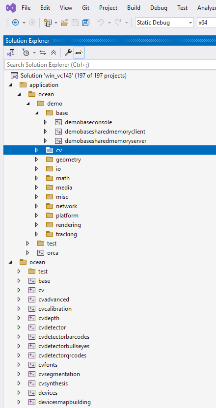
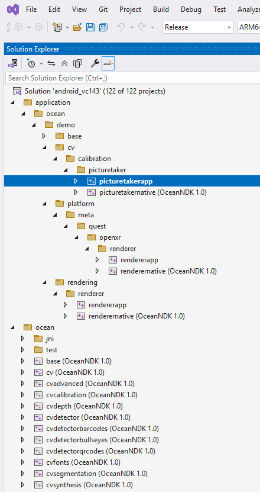

# Building with Visual Studio

Visual Studio provides a comfortable, integrated environment for building and working with Ocean. It offers IntelliSense, graphical debugging, project management, and one-click build-and-run for multiple target platforms.

On Windows, Visual Studio can build Ocean libraries and applications for:

- **Windows** - native desktop applications and libraries
- **Android** - mobile applications with native C++ support
- **OpenXR (Meta Quest)** - VR applications for Meta Quest headsets

Supported Visual Studio versions: **Visual Studio 2022** and **Visual Studio 2026**.

## Table of Contents

- [Building for Windows](#building-for-windows)
- [Building for Android](#building-for-android)
- [Building for OpenXR (Meta Quest)](#building-for-openxr-meta-quest)

---

## Building for Windows

### Prerequisites

1. **Visual Studio 2022 or 2026** with the **Desktop development with C++** workload
2. **Third-party libraries** - built using Ocean's Python build script (see below)

### Building Third-Party Libraries

Before opening the solution, build the required third-party libraries. The Visual Studio solutions reference the per-library install shape (headers at `3rdparty\<lib>\h\<platform>\` and libraries at `3rdparty\<lib>\lib\<target>\`), so pass `--for-external-integration` to produce that layout:

```powershell
cd \path\to\ocean
python build/python/build_ocean_3rdparty.py --for-external-integration
```

> **Tip:** For shorter paths (avoiding Windows path length issues), use a custom output directory:
> ```powershell
> python build/python/build_ocean_3rdparty.py --for-external-integration --output-dir C:\ocean_3rdparty
> ```

Once the build completes, make the installed libraries available to Ocean. The simplest approach is to create a symbolic link from `ocean\3rdparty` to the install directory:

```powershell
cd \path\to\ocean
mklink /D 3rdparty \path\to\ocean_3rdparty\install
```

Alternatively, copy or move the install directory to `ocean\3rdparty`.

> **Note:** The default `build_ocean_3rdparty.py` invocation (without `--for-external-integration`) produces the standard CMake install layout (one prefix per target per library) used by Ocean's CMake build. Visual Studio's hand-maintained `.vcxproj` files do not know about that layout — they need the external-integration shape produced by the flag above. The two layouts are independent; you can have both side by side in separate install directories if you also build via CMake.

### Opening the Solution

| Visual Studio Version | Solution File |
|----------------------|---------------|
| Visual Studio 2022 | `build/visual_studio/win/vc143/win_vc143.sln` |
| Visual Studio 2026 | `build/visual_studio/win/vc145/win_vc145.slnx` |

Open the appropriate solution file in Visual Studio, select a build configuration (Debug or Release), choose a startup project, and build with `Ctrl+Shift+B` or run with `F5`.



---

## Building for Android

Building Android applications with Visual Studio uses Ocean's Android Extension, which adds Android project types, Gradle integration, device deployment, and native C++ debugging directly inside Visual Studio.

### Prerequisites

1. **Visual Studio 2022** with the **Visual Studio extension development** workload (also called the Visual Studio SDK)
2. **Android SDK** and **JDK 17-24** - see the [extension README](../../build/visual_studio/extensions/vc143/android/README.md) for installation details
3. **Android third-party libraries** built in the external-integration layout. Like the Windows solution above, the Android Visual Studio projects reference the per-library `3rdparty\<lib>\h\android\` / `3rdparty\<lib>\lib\android_<target>\` shape:

   ```powershell
   python build/python/build_ocean_3rdparty.py --target android --for-external-integration
   ```

   Then symlink or copy the install dir to `ocean\3rdparty` as in the Windows section.

### Step 1: Build and Install the Ocean Android Extension

The extension source is located at `build/visual_studio/extensions/vc143/android/`.

1. Open `build/visual_studio/extensions/vc143/android/OceanAndroidExtension.sln` in Visual Studio
2. Set the configuration to **Release**
3. Build the solution (`Ctrl+Shift+B`)
4. Navigate to `bin\extensions\android\release\` and double-click `OceanAndroidExtension.vsix` to install it
5. **Start Visual Studio once and close it again** - this allows the extension to initialize and write its registry entries

### Step 2: Install the OceanNDK Application Type

Open PowerShell **as Administrator** and run:

```powershell
cd \path\to\ocean\build\visual_studio\extensions\vc143\android\scripts
.\InstallOceanNDKToolset.ps1
```

This installs the OceanNDK Application Type into Visual Studio's MSBuild directories, enabling native C++ Android projects to load.

### Step 3: Build and Run an Android App

1. Open the Android solution: `build/visual_studio/android/vc143/android_vc143.sln`



2. In Solution Explorer, right-click the **consoleapp** project and select **Set as Startup Project**
3. Set the build configuration to **Debug**
4. Connect an Android phone via USB (with USB debugging enabled)
5. Press `F5` (Start Debugging) to build, deploy, and run the app

> **Note:** For detailed configuration options (SDK paths, NDK detection, JDK setup, debugging, and troubleshooting), see the full [Ocean Android Extension README](../../build/visual_studio/extensions/vc143/android/README.md).

---

## Building for OpenXR (Meta Quest)

Ocean's Android solution also includes OpenXR projects targeting Meta Quest headsets. The same Visual Studio Android workflow applies - the OpenXR projects build as Android applications with additional Quest/OpenXR dependencies.

### Prerequisites

Follow the same setup as [Building for Android](#building-for-android) above, plus:

1. **Meta Quest in Developer Mode** - see [Mobile Device Setup](https://developer.oculus.com/documentation/native/android/mobile-device-setup/)
2. **Oculus (OVR) Platform SDK** (optional, required by some demos) - see [Building for Meta Quest](building_for_meta_quest.md) for details

### Building and Running

1. Open `build/visual_studio/android/vc143/android_vc143.sln`
2. Select an OpenXR project as the startup project
3. Connect your Quest headset via USB
4. Press `F5` to build, deploy, and run

For command-line and Gradle-based Quest builds, see [Building for Meta Quest](building_for_meta_quest.md).
