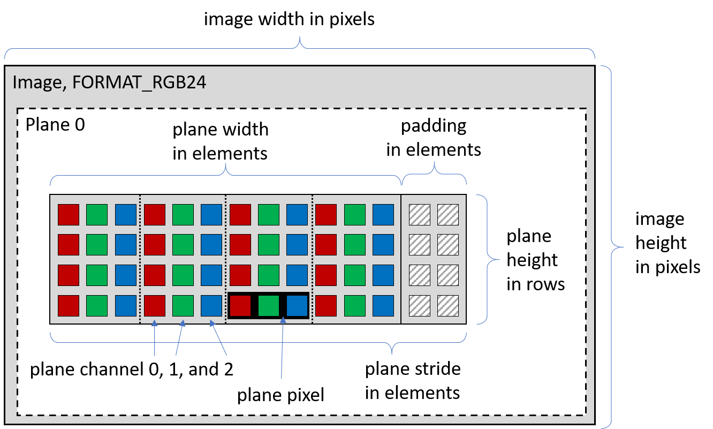
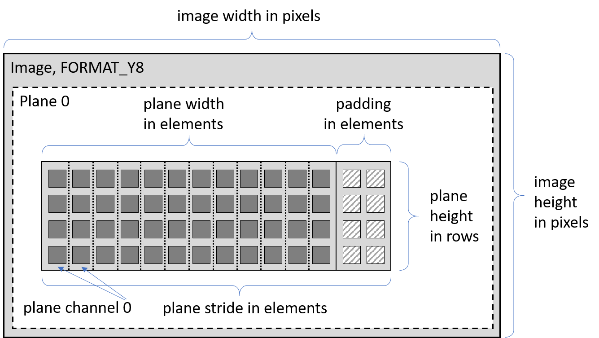
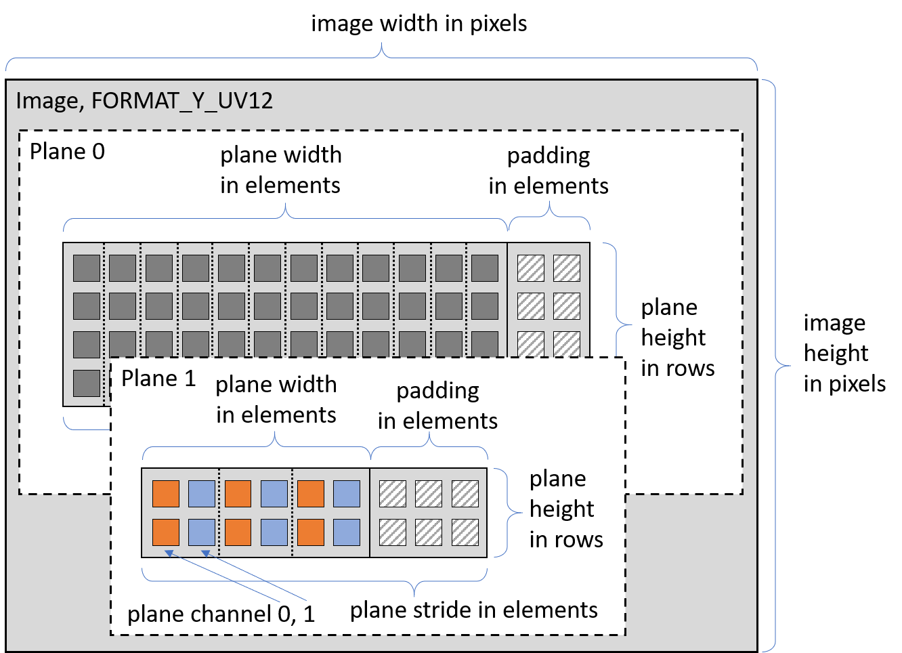
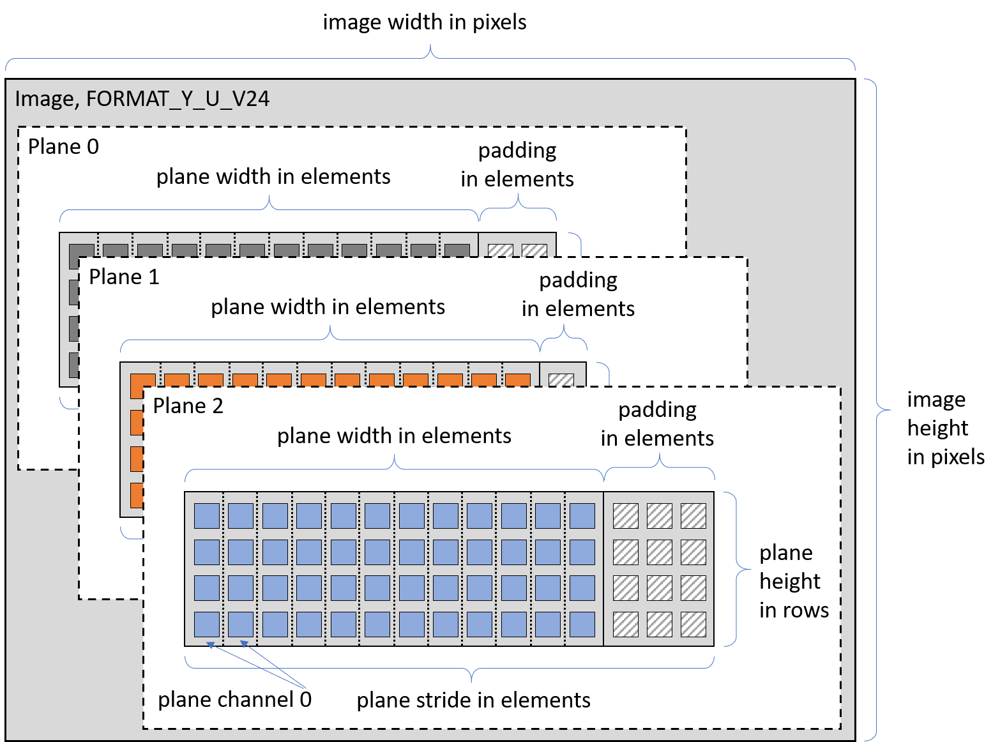
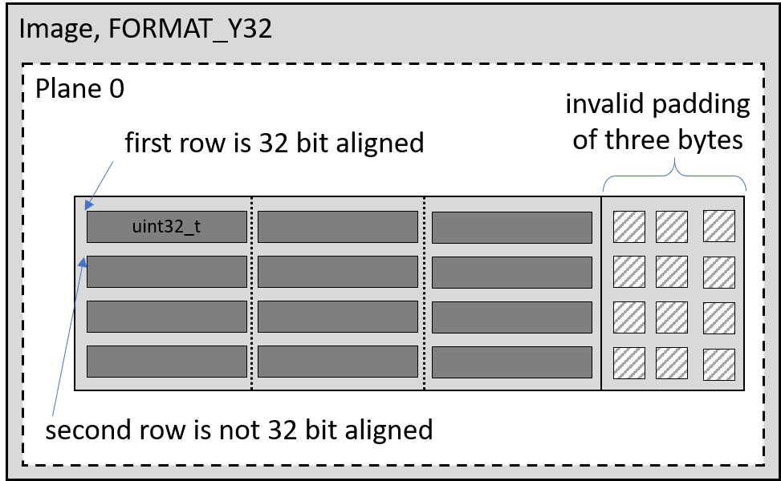
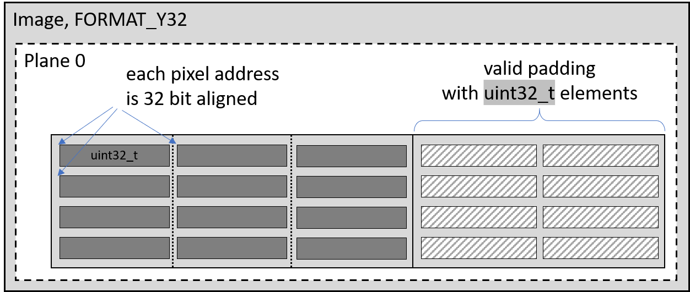

This page outlines how the image class in Ocean is structured, provides a list of best practices, and illustrates some common operations on images using examples.

## The `Frame` class

In Ocean, the class [`Frame`](https://github.com/facebookresearch/ocean/blob/main/impl/ocean/base/Frame.h#L1765) official container for images. It is a lightweight container for images with arbitrary pixel formats. The class supports all pixel formats which are commonly used in mobile apps. This includes common pixel formats like `RGB24` or `Y8`, frames with multiple planes like `Y_UV12` (aka `NV12`), and packed pixels formats like `Y10_Packed` (aka `RAW10`). More than 40+ [pre-defined pixel formats](https://github.com/facebookresearch/ocean/blob/main/impl/ocean/base/Frame.h#L179) exist.

Each frame is composed of at least one plane containing the image information. Each plane can have its own *width*, *height*, and *channel number*. Planes support padding memory at the end of each plane row. Each plane can either own the memory or just use a memory pointer from an external source.
The plane memory is composed of elements of a specific data type, e.g., `uint8_t`, `uint16_t`, `float`, or similar. Depending on the pixel format, a pixel is formed by one or more elements. All planes have the same data type. In case an image has several planes, the value of an image pixel is distributed over several plane pixels, e.g., `Y_UV24`. Otherwise all channels are stored in a single plane, e.g., `RGB24`. This will be explained in details in the examples below.

## Pixel formats and plane layout

This section will discuss some examples of important pixel formats and explain their differences as well as their similarities.

### Format: `RGB24`

An image with pixel format [`RGB24`](https://github.com/facebookresearch/ocean/blob/main/impl/ocean/base/Frame.h#L312) is composed of one plane and the plane has three channels (for red, green, and blue color values). The image memory is based on elements with data type `uint8_t`, with three elements representing a pixel so that each pixel needs 24 bits in memory. The image width in pixels is identical to the plane width in pixels. The plane width in elements is three times the width in pixels. The plane may contain padding elements at the end of each row which then increases the plane’s stride accordingly.



### Format: `Y8`

An image with format [`Y8`](https://github.com/facebookresearch/ocean/blob/main/impl/ocean/base/Frame.h#L591) is very similar to `RGB24`` but the plane has only one channel. Therefore, the width of the image in pixels is identical to the plane's width in elements.



### Format: `Y_UV12`

A common pixel format with two planes is e.g., [FORMAT_Y_UV12](https://fburl.com/diffusion/tfyc4yzm). In Ocean, the  underscore (`_`) between `Y` and `UV` is used to denote that the image information is separated into two planes. The first plane contains the luminance channel of the image, while the second plane contains the two chrominance channels of the image. As a way to reduce bandwidth, the second plane does not define chrominance values for each pixel in the first plane. Instead it defines one for every second pixel only. Thus, the height of the first plane is two times the height of the second plane. In average, the image data is stored with 12 bits per pixels. It's important to note that due to the 2x2 downsampling of the second plane, this pixel format does not allow image dimensions with odd values.



### Format: `Y_U_V24`

Images with the format Y_U_V24 are composed of three planes. Each plane holds one image channel without any sub-sampling.



## Padding and Stride

Each plane can have optional padding memory at the end of each plane row. Planes may use different amounts of padding. The actual memory covered by a plane can be detemined with the following equation

```
plane_width_in_elements  = plane_width_in_pixels * plane_channels
plane_stride_in_elements = plane_width_in_elements + padding_in_elements
plane_stride_in_bytes    = plane_stride_in_elements * bytes_per_element
plane_memory_in_bytes    = plane_stride_in_bytes * plane_height_in_rows
```

### Bytes vs. Elements

Why does Ocean define padding memory in elements and not in bytes? When defining padding w.r.t. elements, a potential memory alignment crash can be avoided automatically without any additional effort.

Imagine an image with pixel format [Y32](https://fburl.com/diffusion/usbsa0em) which is based on elements with data type `uint32_t`. On some platforms, e.g., `armv7`, each pixel value needs to be located in memory with a 32 bit aligned address - otherwise the process will crash when accessing the pixel values. If the plane would allow to define padding in bytes, the user could easily define a padding size which is not a multiple of 4 which will cause the app to crash.



This kind of bug is actually very hard to find as it may not be reproducable. However, this can be easily prevented by defining padding in elements, i.e., the padding size in bytes is always and automatically a multiple of the element size (a multiple of 4 in case of `uint32_t` in the example above).



Ocean has several helper functions to simplify the definition and usage of padding/stride. Often third-party projects specify padding/strides in bytes (and not in elements). For a safe transition, `Frame::strideBytes2paddingElements()` can be used.

```cpp
// the pixel format of the external source
FrameType::PixelFormat pixelFormat = ...

// the external source's image width in pixel
unsigned int imageWidth = ...;

// the external source's image stride in bytes
unsigned int strideInBytes = ...;

unsigned int paddingInElements;
if (Frame::strideBytes2paddingElements(pixelFormat, imageWidth,
                                           strideInBytes, paddingInElements))
{
    std::cout << "The source's padding elements: " << paddingInElements;
}
else
{
   throw "The external source has an invalid stride which leads to memory corruption";
}
```

## Accessing the Image Content

The `Frame` class provides several accessors for the actual image information.

### Plane access

The memory of individual image planes, `planeIndex`, can be accessed with [`constdata()`](https://github.com/facebookresearch/ocean/blob/main/impl/ocean/base/Frame.h#L2706-L2707) and [`data()`](https://github.com/facebookresearch/ocean/blob/main/impl/ocean/base/Frame.h#L2696-L2697):

```cpp
template <typename T> const T* Frame::constdata(const unsigned int planeIndex = 0u) const;
template <typename T> const T* Frame::data(const unsigned int planeIndex = 0u) const;
```

Here, the type `T` denotes the underlying type of the pixel elements. For example, for `FORMAT_RGB48` it will be `T = uint16_t`.

### Row access

An individual row of an image plane, `planeIndex`, can be accessed with [`constrow()`](https://github.com/facebookresearch/ocean/blob/main/impl/ocean/base/Frame.h#L2742-L2743) and [`row()`](https://github.com/facebookresearch/ocean/blob/main/impl/ocean/base/Frame.h#L2724-L2725):

```cpp
template <typename T> T* Frame::row(const unsigned int y, const unsigned int planeIndex = 0u);
template <typename T> T* Frame::constrow(const unsigned int y, const unsigned int planeIndex = 0u);
```

### Pixel access

In case one pixel values need to be accessed, use [`constpixel()`](https://github.com/facebookresearch/ocean/blob/main/impl/ocean/base/Frame.h#L2822-L2823) and [`pixel()`](https://github.com/facebookresearch/ocean/blob/main/impl/ocean/base/Frame.h#L2797-L2798):

```cpp
template <typename T> T* Frame::pixel(const unsigned int x, const unsigned int y, const unsigned int planeIndex = 0u);
template <typename T> T* Frame::constpixel(const unsigned int x, const unsigned int y, const unsigned int planeIndex = 0u);
```

As a rule of thumb, it is recommended to avoid accessing individual pixels and to operate on an entire row instead. This will improve the execution performance.

## Semantics

The default semantic of the `Frame` class ensures that the memory ownership is preserved when creating a new instance of a `Frame` object. That means that the new `Frame` object will be the owner of the image content (by creating a copy) if the source `Frame` is also the owner of the image content. The new `Frame` object will not be the owner of the image content if the source `Frame` is also not the owner of the image content. For example:

```cpp
Frame sourceFrameOwningTheMemory = ...;
Frame newFrameWithCopiedMemory = sourceFrameOwningTheMemory;

Frame sourceFrameNotOwningTheMemory = ...;
Frame newFrameAlsoNotOwningTheMemory = sourceFrameNotOwningTheMemory;

// memory ownership of source and new frames will be identical
assert(sourceFrameOwningTheMemory.isOwner() == newFrameWithCopiedMemory.isOwner());
assert(sourceFrameNotOwningTheMemory.isOwner() == newFrameAlsoNotOwningTheMemory.isOwner());
```

However, when using the copy constructor of `Frame` with explicit copy mode, the copy behavior can be customized.

```cpp
Frame sourceFrame = ...;

// Using memory, not making a copy, the padding layout is preserved.
Frame newFrame(sourcFrame, Frame::ACM_USE_KEEP_LAYOUT);

// Make a copy of the memory,
// but the new memory will be continuous and the source padding data is not touched
Frame newFrame(sourcFrame, Frame::ACM_COPY_REMOVE_PADDING_LAYOUT);

// Make a copy of the memory,
// the new memory will have the same padding layout as the source image,
// but the actual padding data is not copied
Frame newFrame(sourcFrame, Frame::ACM_COPY_KEEP_LAYOUT_DO_NOT_COPY_PADDING_DATA);

// Make a copy of the memory,
// the new memory will have the same padding layout as the source image,
// the padding data is copied as well
Frame newFrame(sourcFrame, Frame::ACM_COPY_KEEP_LAYOUT_COPY_PADDING_DATA);
```

## Examples

### Creating images

#### Image with one plane

First, we define the type of the new image. The `FrameType` is specified by the image resolution, the pixel format, and the origin of the pixel data (either top-left corner, or bottom-left corner). Afterwards the new `Frame` object can be created which then will allocate the necessary memory.

```cpp
#include "ocean/base/Frame.h"

using namespace Ocean;

FrameType frameType(1280u, 720u, FrameType::FORMAT_RGB24, FrameType::ORIGIN_UPPER_LEFT);
Frame frameOwningTheMemory(frameType);
```

#### Image with two planes
Creating an image with different pixel format (e.g., a pixel format with two planes) is similar.

```
FrameType frameType(1920u, 1080u, FrameType::FORMAT_Y_UV12, FrameType::ORIGIN_UPPER_LEFT);
Frame frameOwningTheMemory(frameType);
```

#### Wrapping existing memory with `Frame`
Now, we create a new `Frame` object, we already have the memory and we do not want to make a copy of the memory. The pixel format has only one image plane.

```
uint8_t* existingMemory = ...;
unsigned int paddingElements = ...;

FrameType frameType(1920u, 1080u, FrameType::FORMAT_RGB24, FrameType::ORIGIN_UPPER_LEFT);
Frame frameOwningTheMemory(frameType, existingMemory, Frame::CM_USE_KEEP_LAYOUT, paddingElements);
```


#### Initializers for image with multiple planes ====

Now, we create a `Frame` object with a pixel format with several image planes.

```cpp
FrameType frameType(1920u, 1080u, FrameType::FORMAT_Y_U_V24, FrameType::ORIGIN_UPPER_LEFT);

Frame::PlaneInitializers<uint8_t> planeInitializers;

uint8_t* existingMemoryPlaneY = ...;
unsigned int paddingMemoryPlaneY = ...;

// the first plane will not be the owner of the given memory
planeInitializers.emplace_back(existingMemoryPlaneY, CM_USE_KEEP_LAYOUT, paddingMemoryPlaneY);

uint8_t* existingMemoryPlaneU = ...;
unsigned int paddingMemoryPlaneU = ...;

// the second plane will be the owner of the memory as a copy will be created
planeInitializers.emplace_back(existingMemoryPlaneU,
			CM_COPY_REMOVE_PADDING_LAYOUT, paddingMemoryPlaneU);

unsigned int paddingMemoryPlaneV = ...;

// the memory of the third plane does not exist,
// we create a third plane with own (un-initialized) memory
planeInitializers.emplace_back(paddingMemoryPlaneV);

Frame newFrame(frameType, planeInitializers);
```

A more compact way to express the above could be the following:

```cpp
Frame newFrame(frameType,
  Frame::PlaneInitializers<uint8_t>{
    Frame::PlaneInitializer<uint8_t>(planeY, CM_USE_KEEP_LAYOUT, paddingY),
    Frame::PlaneInitializer<uint8_t>(planeU, CM_COPY_REMOVE_PADDING_LAYOUT, paddingU),
    Frame::PlaneInitializer<uint8_t>(paddingV)
  });
```

#### Custom formats

At the time of writing, Ocean support 50+ [pre-defined pixel formats](https://github.com/facebookresearch/ocean/blob/main/impl/ocean/base/Frame.h#L151-L179) which commonly define the precise layout of the color channel (e.g., `FORMAT_RGB24` vs. `FORMAT_BGR24`). Adding a new pre-defined pixel format is straight forward. However, often a generic pixel format can be used on-the-fly in case the user does not need to keep track of e.g., the layout of the color channels.

This is an example of a generic pixel format for an image with two channels of `float` numbers on one plane (the properties of the pixel format are known at compile time):
```cpp
// generic pixel format, float, 2 channels, one plane
FrameType::PixelFormat customPixelFormat = FrameType::genericPixelFormat<float, 2u>();
FrameType frameType(1920u, 1080u, customPixelFormat, FrameType::ORIGIN_UPPER_LEFT);

Frame newFrame(frameType);
```

This is another example of a generic pixel format for an image with three `uint16_t` channels on one plane (the properties of the pixel format are known at run time):

```cpp
// generic pixel format, uint16_t, 3 channels, one plane

FrameType::DataType dataType = FrameType::DT_UNSIGNED_INTEGER_16;
FrameType::PixelFormat customPixelFormat
	= FrameType::genericPixelFormat(DT_UNSIGNED_INTEGER_16, 3u);
FrameType frameType(1920u, 1080u, customPixelFormat, FrameType::ORIGIN_UPPER_LEFT);

Frame newFrame(frameType);
```

And one last of a generic pixel format for an image with 1 channel of `uint8_t` elements on *two* planes. Please that the image width must be a multiple of two (the properties of the pixel format are known at run time):

```cpp
FrameType::PixelFormat customPixelFormat = FrameType::genericPixelFormat<uint8_t, 1u, 2u, 2u>();
FrameType frameType(1920u, 1080u, customPixelFormat, FrameType::ORIGIN_UPPER_LEFT);

Frame newFrame(frameType);
```

### Checking properties of an image

Often functions need to ensure that a given image has a specific pixel format, is composed of several channels, planes or holds a specific element data type. Here are just some examples of functions the `Frame` class provides.

```cpp
void function(Frame& frame)
{
  if (frame.isValid() == false) // the frame does not contain any image data
    return;

  if (frame.pixelFormat() == FrameType::FORMAT_Y_UV12) // check specific pixel format
    return;

  if (frame.channels() != 3u) // check number of color channels
    return;

  if (frame.dataType() != FrameType::DT_UNSIGNED_INTEGER_8) // check the data type
    return;

  if (frame.numberPlanes() != 1) // check number of image planes
     return;

  if (frame.isOwner() == false) // the Frame is not the owner of the memory
    return;

  if (frame.isReadOnly()) // the Frame's memory cannot be modified
    return;

  // check for general compatibility between pixel formats in terms of memory layout
  if (FrameType::arePixelFormatsCompatible(frame.pixelFormat(), FrameType::FORMAT_RGB24) == false)
    return;

  uint8_t* firstPixel = frame.pixel(0u, 0u);
  firstPixel[0] = 0x00;
  firstPixel[1] = 0x80;
  firstPixel[2] = 0xFF;
}
```

### Resizing images

Ocean provides a simple method for image resizing and scaling.

```
#include "ocean/cv/FrameInterpolator.h"

using namespace Ocean;

Frame sourceFrame = ...;

unsigned int newWidth = sourceFrame.width() * 3u / 4u;
unsigned int newHeight = sourceFrame.height();

FrameType resizedFrameType(sourceFrame.frameType(), newWidth, newHeight);
Frame resizedFrame(resizedFrameType);

CV::FrameInterpolator::resize(sourceFrame, resizedFrame);
```

For more details and a visual comparisons of the available image resizing methods, see [Image Resizing](image-resizing).

### Reading and writing images

Ocean supports several third-party image encoders and decoders. The [IO::Image](https://github.com/facebookresearch/ocean/blob/main/impl/ocean/io/image/Image.h#L30) library wraps the third-party code and provides a unified and platform independent interface.

### Load from file

To load an image from a file on disk, try the following:

```cpp
#include "ocean/io/image/Image.h"

using namespace Ocean;

Frame loadedFrame = IO::Image::readImage("/path/to/my/image.png");

if (loadedFrame.isValid())
{
  // let's convert the PNG image to a JPG image
  IO::Image::writeImage(loadedFrame, "/path/to/my/image.jpg"))
}
```

#### Load from memory

To load (and decode) an image from a buffer that is stored in memory, try the following:

```cpp
#include "ocean/io/image/Image.h"

using namespace Ocean;

const void* sourceImageBuffer = ...;
size_t sourceImageBufferSize = ...;

Frame decodedFrame = IO::Image::decodeImage(sourceImageBuffer, sourceImageBufferSize);

if (decodedFrame.isValid())
{
  // let's convert the image to a JPG image and store the data in a buffer

   std::vector<uint8_t> targetImageBuffer;
   IO::Image::encodeImage(decodedFrame, "jpg", targetImageBuffer))
}
```

### Converting images

Ocean offers highly optimized converts between different pixel formats. Here is the [list of currently supported](https://github.com/facebookresearch/ocean/blob/main/impl/ocean/cv/FrameConverter.cpp#L166) converters. Converting an image from any pixel format to any other pixel format needs one function call.

```cpp
#include "ocean/cv/FrameConverter.h"

Frame sourceFrame = ...;

FrameType::PixelFormat targetPixelFormat = FrameType::FORMAT_RGB24;
FrameType targetFrameType(sourceFrame.frameType(), targetPixelFormat);
bool forceCopy = FrameType::CP_AVOID_COPY_IF_POSSIBLE;

Frame targetFrame;
if (!CV::FrameConverter::Comfort::convert(sourceFrame, targetFrameType, targetFrame, forceCopy))
{
   Log::info() << "The source image could not be converted to RGB24";
   return;
}

assert(targetFrame.pixelFormat() == FrameType::FORMAT_RGB24);
```

### Debugging an image on iOS

Ocean provides simple access to use Apple's standard sharing capabilities via [`shareImages()`](https://github.com/facebookresearch/ocean/blob/main/impl/ocean/platform/apple/ios/Utilities.h#L95). You can send images to your Mac via AirDrop, you can save an image locally or you can save an image in your Dropbox folder.

```cpp
#include "ocean/base/Frame.h"
#include "ocean/cv/Canvas.h"
#include "ocean/platform/apple/ios/Utilities.h"

using namespace Ocean;

void function(Frame& anyImage)
{
  // do something with the image, e.g., paint into the image

  // share the image
  Platform::Apple::IOS::Utilities::shareImage(anyImage);
}
```

You may also want to check out [`Chisel`](https://github.com/facebook/chisel).
